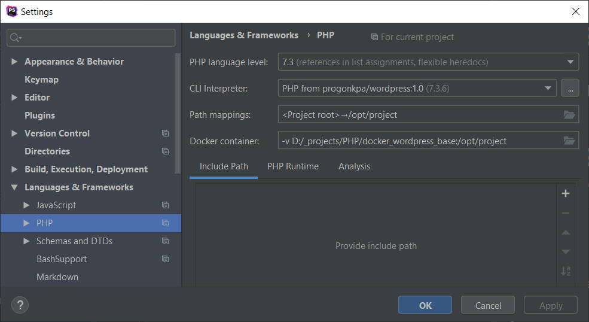
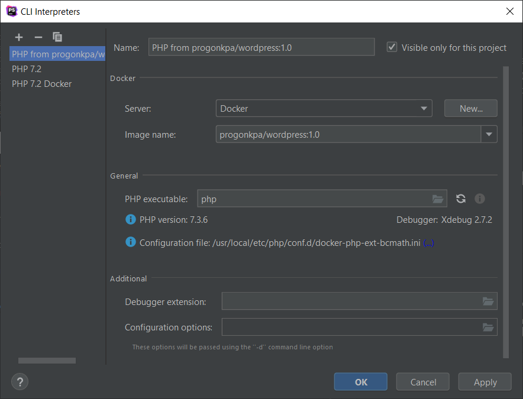
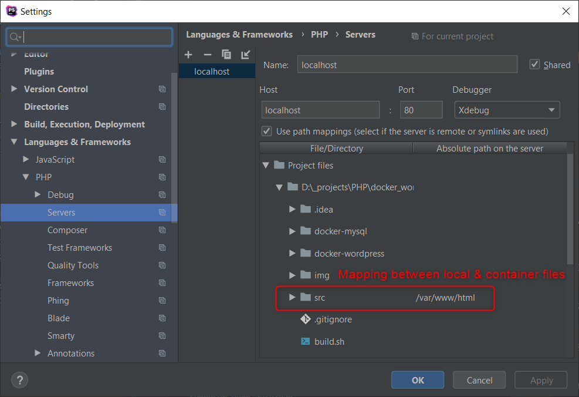
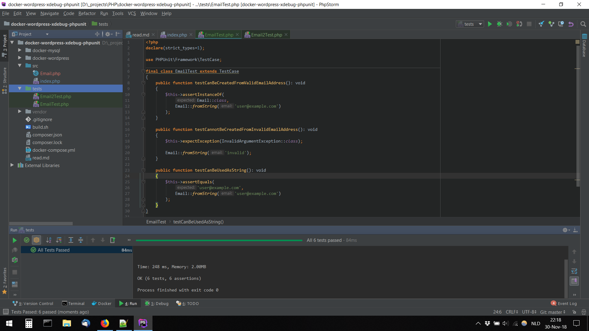
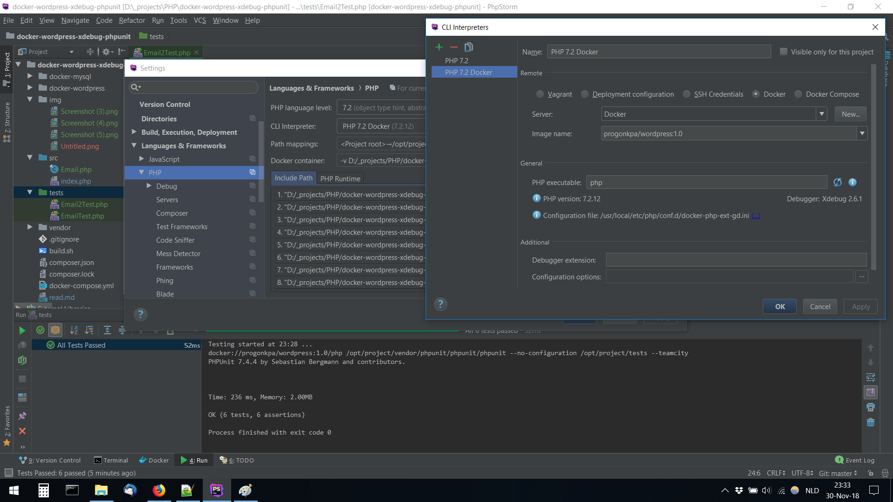
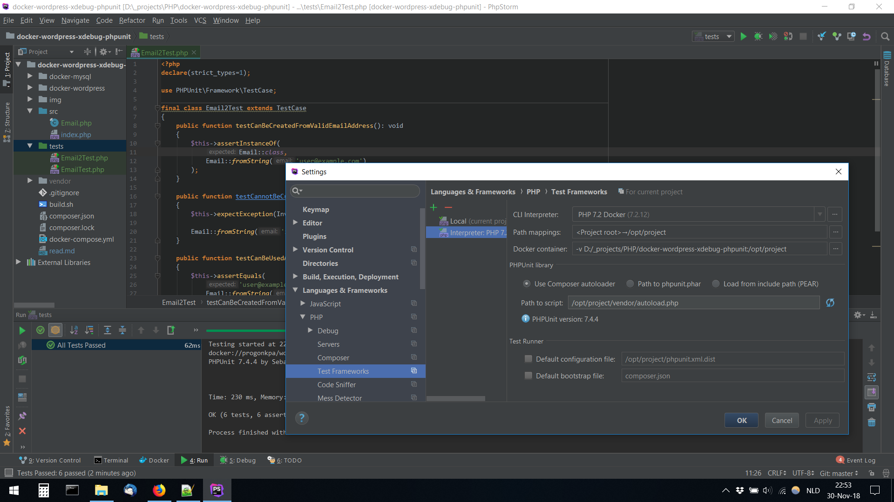

#Configure XDebug in PHPStorm
1. Configure the PHP interpreter to point to the PHP executable in the Docker container.  
Settings > Languages & frameworks > PHP  
PHP settings

PHP interpreter settings

2. Configure a PHP server that points to the Docker container running Apache/NGINX and map the local web root to the remote web root (/var/www/html) 
Settings > Languages & frameworks > PHP > Servers

3. Activate the debugger in the toolbar so it's listening
4. Activate the XDebug browser extension
5. Put a breakpoint and navigate to the the page 

#Configure PHPUnit running in Docker in PHPStorm
##Goal
Run all tests via context menu "Run all tests" in the context menu of the tests directory.

##Errors
1. File did not have the .php extensions
    ```
    Add .php extension to files.
    ```

3. Class not in class map (./vendor/composer/autoload_classmap.php)
    ```
    composer dump-autoload
    ```
##PHPUnit configuration in Test Frameworks (PHPStorm settings)

Successful run of all test via context menu of directory "test"


PHP (CLI) interpreter Docker settings


Test Frameworks settings
